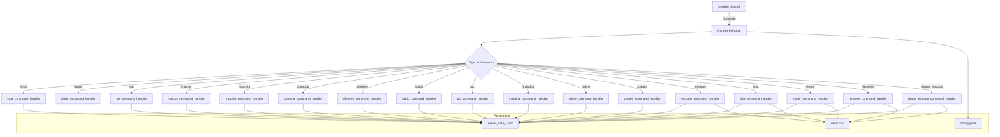

# Plano de Revisão, Documentação e Modularização — Projeto ostervalt.jl

## 1. Objetivo

Revisar, documentar e sugerir modularização/refatoração para o código do projeto ostervalt.jl, visando facilitar manutenção, colaboração e evolução do sistema.

---

## 2. Documentação Interna

- **Adicionar docstrings** em todas as funções, especialmente nos handlers de comandos e utilitários.
- **Comentar blocos de lógica complexa**, como permissões, economia, inventário e fluxo de comandos.
- **Explicar a estrutura dos dados persistidos** (arquivos JSON, cache, config.yaml).
- **Padrão:** Utilizar docstrings compatíveis com [Documenter.jl](https://juliadocs.github.io/Documenter.jl/stable/).

---

## 3. Documentação Externa

- **README.md**:
  - Descrição do projeto e objetivo.
  - Instruções de instalação e configuração (dependências, variáveis de ambiente, arquivos necessários).
  - Exemplos de uso dos comandos principais.
  - Estrutura dos arquivos de configuração e dados.
- **Guia rápido de comandos** para usuários finais.

---

## 4. Sugestões de Modularização/Refatoração

- **Separar handlers de comandos** em arquivos/funções específicas para facilitar manutenção.
- **Agrupar funções utilitárias** e manipulação de dados em módulos próprios.
- **Identificar pontos de possível refatoração** para facilitar testes e manutenção futura.

---

## 5. Diagrama de Alto Nível

---

## 6. Roteiro de Execução

1. **Documentar internamente o código** (docstrings e comentários explicativos).
2. **Criar/atualizar README.md** e guia de comandos.
3. **Sugerir modularização/refatoração** e registrar no Memory Bank.
4. **(Opcional)** Implementar estrutura modularizada em etapas futuras.

---

## 7. Observações

- O plano pode ser ajustado conforme feedback.
- Recomenda-se registrar decisões e progresso no Memory Bank para rastreabilidade.